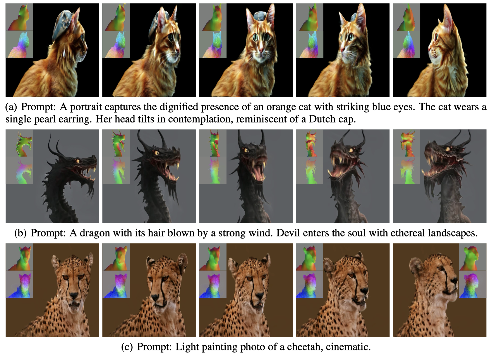

# Vidu4D

Official implementation of [Vidu4D: Single Generated Video to High-Fidelity 4D Reconstruction with Dynamic Gaussian Surfels](https://vidu4d-dgs.github.io).

<div align="left">
  <a href="https://vidu4d-dgs.github.io/"></a> &ensp;
  <a href="https://arxiv.org/abs/2405.16822"></a> &ensp;
</div>


Code will be released soon.


## Overview

<p align="center">
    
</p>


## Acknowledgements 
Our code is built based on [2DGS](https://github.com/hbb1/2d-gaussian-splatting) and [Lab4D](https://github.com/lab4d-org/lab4d). We thank the authors for their great repos.


## BibTeX

```
@article{wang2024vidu4d,
  title={Vidu4D: Single Generated Video to High-Fidelity 4D Reconstruction with Dynamic Gaussian Surfels},
  author={Yikai Wang and Xinzhou Wang and Zilong Chen and Zhengyi Wang and Fuchun Sun and Jun Zhu},
  journal={arXiv preprint arXiv},
  year={2024}
}
```

