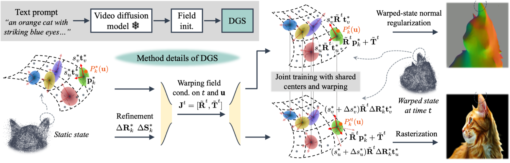
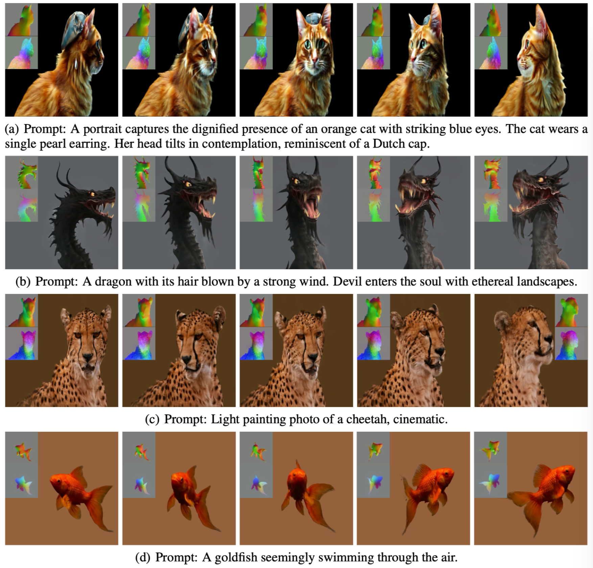

# Vidu4D

Official implementation of Vidu4D: Single Generated Video to High-Fidelity 4D Reconstruction with Dynamic Gaussian Surfels.

> [**Vidu4D: Single Generated Video to High-Fidelity 4D Reconstruction with Dynamic Gaussian Surfels**](https://arxiv.org/abs/2405.16822)<br>
> [Yikai Wang](https://yikaiw.github.io/)\*, [Xinzhou Wang](https://zz7379.github.io/)\*, [Zilong Chen](https://scholar.google.com/citations?user=2pbka1gAAAAJ&hl=en), [Zhengyi Wang](https://thuwzy.github.io/), [Fuchun Sun](https://scholar.google.com/citations?user=DbviELoAAAAJ&hl=en), [Jun Zhu](https://ml.cs.tsinghua.edu.cn/~jun/index.shtml)

<div align="left">
  <a href="https://vidu4d-dgs.github.io/"></a> &ensp;
  <a href="https://arxiv.org/abs/2405.16822"></a> &ensp;
</div>

## Overview
<p align="center">
    
</p>

## 4D Results
See accompanying videos in our [project page](https://vidu4d-dgs.github.io/) for better visual quality.
<p align="center">
    
</p>


## Todo
- Release code for Vidu4D: intializing and training DGS.

## BibTeX
```
@article{wang2024vidu4d,
  title={Vidu4D: Single Generated Video to High-Fidelity 4D Reconstruction with Dynamic Gaussian Surfels},
  author={Yikai Wang and Xinzhou Wang and Zilong Chen and Zhengyi Wang and Fuchun Sun and Jun Zhu},
  journal={arXiv preprint arXiv},
  year={2024}
}
```
